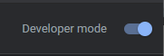

<h1 align="center">Welcome to TwitchBonusClicker 👋</h1>
<p>
  
</p>

> TwitchBonusClicker is a google chrome extension that allow you to peacefully farm your favorite stream channel point.

## How To install

1.	Download the repository
  
Using git
  ```sh
    git clone https://github.com/bfresnel/TwitchBonusClicker.git
  ```
or download the zip file and extract then

2. Enter on chrome extensions
  ```
    chrome://extensions/
  ```

3. Enable development mode on chrome extensions page

  

4. Load unpacked extension, select the current folder where you downloaded the files

  

5. If the extension is correctly installed, you should see this :

  